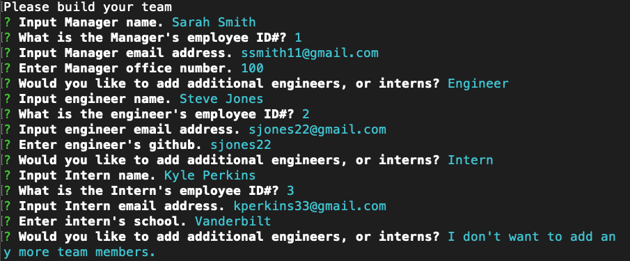

# Team Profile Generator
  
  
  ## Description
  
  This is a Team Profile Generator which one executes through prompts in the command line. Any professional team needs a webpage, to be taken seriously. This application will take that burden off your hands. Simply type your answers in the prompt, and watch the magic happen. This application was created using JavaScript, Node.js, npm’s Inquirer, Bootstrap, and CSS.

  ## Table of Contents

  * [Installation](#installation)
  * [Usage](#usage)
  * 
  * [Contributors](#contributors)
  * [Questions](#questions)
  
  ## Installation

  [README Generator](https://joelecox1.github.io/team-profile-generator/.)

  Clone this repository and type 'npm i inquirer' in the command line in the root folder. Then type 'node index'. Answer the questions provided in the prompt. Your HTML and associated CSS files will be generated in the output directory.

  ## Usage

  [Instructional video for application usage](https://bit.ly/3r36TSE)

  

  ## Contributors

  Joel Cox

  ## License
      
        This project is licensed under the MIT License.
      

  ## Test

  Run the following commad to run tests on your application:

  'npm test'

  ## Questions

  If there are any further questions, please feel free to reach out to me. 

  - Email: joelecox1@gmail.com
  - GitHub: [joelecox1](https://github.com/joelecox1)
